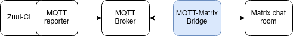

# :bridge_at_night: Zuul MQTT reporter -> Matrix chat bridge

[](https://github.com/SovereignCloudStack/zuul-mqtt-matrix-bridge/releases)
[](https://goreportcard.com/report/github.com/sovereignCloudStack/zuul-mqtt-matrix-bridge)
[](https://opensource.org/licenses/Apache-2.0)

Relay MQTT reports from [Zuul-CI](https://zuul-ci.org/) to the [Matrix chat](https://matrix.org/).

Currently, Zuul-CI has the capability to distribute build reports to various supported platforms
(refer to the supported drivers [list](https://zuul-ci.org/docs/zuul/latest/drivers/index.html)).
However, there is currently no built-in support for conveniently sending these build reports to the Matrix chat.

This project offers a straightforward solution for receiving build reports from Zuul's MQTT reporter and,
using a predefined template, forwarding these messages to a Matrix chat room.

Currently, a single instance of "zuul-mqtt-matrix-bridge" has the capability to subscribe to multiple MQTT topics.
However, it forwards all messages to just one Matrix room, resulting in an N:1 relationship between MQTT topics
and Matrix rooms for each "zuul-mqtt-matrix-bridge" instance. 



## Usage

This section describes a method for integrating the zuul-mqtt-matrix-bridge project into your Zuul-CI infrastructure. It assumes that your Zuul infrastructure is running within Docker containers on the same Docker network. If your setup is different, you can still follow this guide, but make sure that your Zuul deployment can access the MQTT broker container.

### MQTT Broker configuration

The MQTT broker serves as the backend system responsible for handling messages between the Zuul MQTT client, acting as a publisher, and the zuul-mqtt-matrix-bridge client, acting as a subscriber. The [docker-compose](./docker/docker-compose.yaml) file deploys the Eclipse Mosquitto server, an open-source message broker that utilizes the MQTT protocol.

You can explore a basic MQTT broker configuration file, [mosquitto.conf](./docker/mosquitto_config/mosquitto.conf), which ensures broker persistence and enforces client authentication via a password file. A password file is a straightforward method for storing usernames and their corresponding encrypted passwords in a single file. Additionally, an example [password file](./docker/mosquitto_config/pwfile) is provided, already containing a user record for the username `mqtt-user` with the password `secret`. You are strongly advised to change these credentials.

If you need to modify or create an additional password file, please refer to this [guide](https://mosquitto.org/documentation/authentication-methods/).


### zuul-mqtt-matrix-bridge configuration

See the current list of supported configuration options along with their default values:

```text
  -matrix-homeserver string
        Matrix homeserver (default "https://matrix.org")
  -matrix-msg-template string
        Matrix template file (default "./templates/matrix_message.tmpl")
  -matrix-room-id string
        Matrix room ID
  -matrix-token string
        Matrix access token
  -mqtt-broker string
        The MQTT Broker (default "tcp://localhost:1883")
  -mqtt-pass string
        The MQTT password
  -mqtt-topic string
        The MQTT topic to subscribe (default "zuul/#")
  -mqtt-topic-qos int
        The MQTT topic to subscribe
  -mqtt-user string
        The MQTT user
```

All the configuration options mentioned above can be overridden by environment variables specified in the docker-compose file. You can refer to the [.env](./docker/.env) file for the default values.

### Deployment 

If you intend to connect the zuul-mqtt-matrix-bridge and MQTT broker containers to the pre-existing Zuul-CI Docker networks, ensure that you override the NETWORK_NAME and NETWORK_IS_EXTERNAL variables. Furthermore, remember to override the MATRIX_ROOM_ID and MATRIX_TOKEN variables to guarantee that Zuul reports reach the specific Matrix room of your choice.

1. Clone the repository
```bash
git clone https://github.com/SovereignCloudStack/zuul-mqtt-matrix-bridge.git
```

2. Deploy zuul-mqtt-matrix-bridge and MQTT broker containers
```bash
cd ./zuul-mqtt-matrix-bridge/docker

NETWORK_NAME=<zuul-network-name> \
NETWORK_IS_EXTERNAL=true \
MATRIX_ROOM_ID=<token> \
MATRIX_TOKEN=<room-id> \
docker-compose up -d
```

3. Adjust your existing Zuul-CI installation's configuration to establish connectivity with the MQTT broker container. Refer to the relevant Zuul [configuration options](https://zuul-ci.org/docs/zuul/latest/drivers/mqtt.html#connection-configuration) for more details

```bash
$ cat zuul.conf 
...
[connection "mqtt"]
name=mqtt
driver=mqtt
server=mqtt-broker
port=1883
user=mqtt-user
password=secret
...
```

4. Set up the pipeline to transmit MQTT reports using the connection named as `mqtt`. Refer to the relevant Zuul [configuration options](https://zuul-ci.org/docs/zuul/latest/drivers/mqtt.html#reporter-configuration) for more details.

```yaml
- pipeline:
    name: check
    success:
      mqtt:
        topic: "zuul/{pipeline}/{project}/{branch}/{change}" # By default, the zuul-mqtt-matrix-bridge subscribes to all topics that have names starting with `zuul` ("zuul/#")
```

## Matrix messages

By default, Matrix messages are generated using the template file `templates/matrix_message.tmpl`.
You have the flexibility to use a custom template file by specifying it with the optional argument 
`-matrix-msg-template`. You are free to utilize any variables defined in Zuul's MQTT reporter message
schema, which can be found in the Zuul [documentation](https://zuul-ci.org/docs/zuul/latest/drivers/mqtt.html#message-schema) as well as in this project.

### Example messages

The following examples are generated using the default template file `templates/matrix_message.tmpl`.

<hr style="width:30%;margin-left:0;"></hr>

ℹ️ Starting example jobs.

**Pipeline:** example pipeline<br>
**Project:** example/project<br>
**Pull request:** [#PR](http://example)<br>
**Triggered:** 2000-10-20 09:00:40 +0200 CEST

<hr style="width:30%;margin-left:0;"></hr>

✅ Build succeeded.

**Pipeline:** example pipeline<br>
**Project:** example/project<br>
**Pull request:** [#PR](http://example)<br>
**Triggered:** 2000-10-20 09:00:40 +0200 CEST<br>
**Buildset:** [SUCCESS](http://example/buildset)<br>
**Builds:**
- **example-job-1:** [SUCCESS](http://example/build1)
  - **Start/End:** 2000-10-20 09:02:40 +0000 UTC -> 2000-10-20 09:03:14 +0000 UTC
  - _Analyze the related [logs](http://example/logs1)_
- **example-job-2:** [SUCCESS](http://example/build2)
  - **Start/End:** 2000-10-20 09:02:40 +0000 UTC -> 2000-10-20 09:03:15 +0000 UTC
  - _Analyze the related [logs](http://example/logs2)_

<hr style="width:30%;margin-left:0;"></hr>

⚠️ Build canceled (example pipeline).

**Pipeline:** example pipeline<br>
**Project:** example/project<br>
**Pull request:** [#PR](http://example)<br>
**Triggered:** 2000-10-20 09:00:40 +0200 CEST

<hr style="width:30%;margin-left:0;"></hr>

❌ Build failed (example pipeline).

**Pipeline:** example pipeline<br>
**Project:** example/project<br>
**Pull request:** [#PR](http://example)<br>
**Triggered:** 2000-10-20 09:00:40 +0200 CEST<br>
**Buildset:** [FAILURE](http://example/buildset)<br>
**Builds:**
- **example-job-1:** [SUCCESS](http://example/build1)
  - **Start/End:** 2000-10-20 09:02:40 +0000 UTC -> 2000-10-20 09:03:14 +0000 UTC
  - _Analyze the related [logs](http://example/logs1)_
- **example-job-2:** [FAILURE](http://example/build2)
  - **Start/End:** 2000-10-20 09:02:40 +0000 UTC -> 2000-10-20 09:03:15 +0000 UTC
  - _Analyze the related [logs](http://example/logs2)_

<hr style="width:30%;margin-left:0;"></hr>

## Local development

Refer to the relevant [docs](./docs/local_development.md) section.

## TODOs

- Add unit tests
- Add TLS support for "MQTT broker" <-> "zuul-mqtt-matrix-bridge" connection

# Acknowledgment

A portion of bridge code is inspired by @dereisele's project [tuple](https://github.com/dereisele/tuple).
